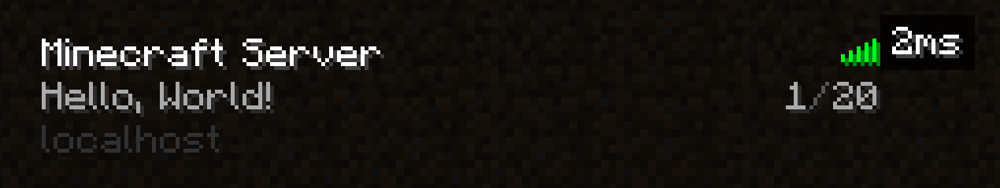

# Go Minecraft Protocol

This project aims to reverse engineer the Minecraft server protocol, and create a bare-minimum implementation of the protocol in Go from scratch, using [wiki.vg](https://wiki.vg/Main_Page) as a crucial reference in the process.

This is just a hobby project, and very little has been implemented thus far.

So far, I have implemented "server status" packets for every Minecraft version from when the multiplayer server status was first introduced in 2011, right up to the latest version at the time of writing (1.21.3 released in 2024). This required significant work to take into account every protocol change since the beginning, especially considering the lack of version detection in the original protocol.

Additionally, for only version 1.14, I have implemented player joining, player movement, and sending chunks of blocks to the client. Unfortunately, the in-game server protocol varies so significantly between versions, that I had to focus on only one Minecraft version first.

## Run Test Server

 - Install Go version `^1.23.2`.
 - Clone this repository.
 - `cd testserver`.
 - `go run main.go`.
 - See `DEVELOPMENT.md` for more information.

## Development

 - See `DEVELOPMENT.md`.

## Screenshots

### Server List Ping

**Minecraft Beta 1.8 (2011)**

**Minecraft 1.7.5 (2014)**

**Minecraft 1.23.2 (2024)**

### Joining World

**Minecraft 1.14.4**

### Server Log

